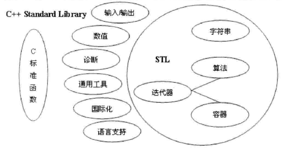

#### STL是C++标准程序库的子集
STL（Standard Template Library),即标准模板库。是一个具有工业强度的，高效的C++程序库。它被容纳于C++标准程序库（C++ Standard Library)中。

- 涵盖了常用的数据结构和算法
- 具有跨平台的特点

#### STL六大组件

1. 容器（containers)
- 序列容器（vector,string,deque,list)
- 关联容器（set,map,multiset)
- 适配容器(stack,queue,priority_queue)
2. 分配器（Allocator)
- 为容器分配内存空间
3. 迭代器（Iterator)
- 遍历容器的指针，支持--,++，*等操作
4. 算法（Algorithms)
- 常用的数据结构算法（sort等函数）
5. 适配器（Adapters)
6. 仿函数（Functors)
