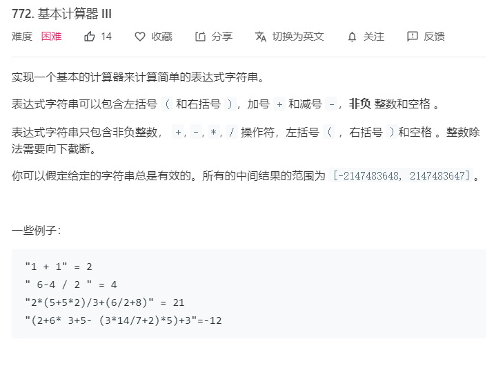

分析：可以将问题进行拆解，一步一步的进行分析。

- 先考虑只有‘+’的情况
- 在1的条件下考虑加入‘-’的情况
- 考虑加入‘*’和‘/’的情况
- 最后考虑加入‘（）’

#### 1. 只有加号

如果只有加号，题目中只有非负整数，那么遇到数字就进行相加即可。这里我们用queue来进行操作

```
int calculate(string s){
    queue<char> que;
    for(char c : s){
        //用来排除空格
        if(c != ' '){
            que.push(c);
        }
    }
    /num用来记当前的数字大小，sum记最后的总和
    int num = 0, int sum = 0;
    
    while(!que.empty()){
        char cur = que.front();
        que.pop();
        //若当前是数字
        if(cur >= '0' && cur <= '9'){
            num = num*10 + cur - '0';
        }
        else{
            sum += num;
            num  = 0;
        }
    }
    //最后+num是因为最后一个数字后没有符号，需要直接加到sum。
    sum += num;
    return sum;
}
```

#### 2. 引入减号

引入减号，例如1+2-10，可以看成1+2+(-10)从而转换成加法，但是需要一个sign用来记录当前符号是+还是-。
```
int calculate(string s){
    queue<char> que;
    for(char c : s){
        //用来排除空格
        if(c != ' '){
            que.push(c);
        }
    }
    //用来处理上述1中的最后一个数字的情况。
    que.push('+');
    /num用来记当前的数字大小，sum记最后的总和
    int num = 0, int sum = 0;
    //记录当前符号
    char sign = '+';
    
    while(!que.empty()){
        char cur = que.front();
        que.pop();
        //若当前是数字
        if(cur >= '0' && cur <= '9'){
            num = num*10 + cur - '0';
        }
        else{
            if(sign == '+'){
                sum += num;
            }
            else{
                sum -= num;
            }
            num  = 0;
            sign = cur;
        }
    }
    return sum;
}
```

#### 3.引入乘除

注意：当加入乘除后，就需要考虑运算的优先级了，不能像1，2那样傻瓜的计算+-。

这里引入一个stack<int> stk 用来存储数字，遇到+号，直接push(num),遇到-号，push(-num),当遇到*或/时，取出栈顶进行计算，计算后的结果push进栈中，最后依次相加栈中的元素即可。

```
int calculate(string s){
    queue<char> que;
    for(char c : s){
        if(c != ' '){
            que.push(c);
        }
    }
    int num = 0, sum = 0;
    char sign = '+';
    stack<int> stk;
    
    while(!que.empty()){
        char cur = que.front();
        que.pop();
        
        if(cur >= '0' && cur <= '9'){
            num = num * 10 + cur - '0';
        }
        else{
            if(sign == '+'){
                stk.push(num);
            }
            else if(sign == '-'){
                stk.push(-num);
            }
            else if(sign == '*'){
                int x = stk.top();
                stk.pop();
                stk.push(x * num);
            }
            else if(sign == '/'){
                int x = stk.top();
                stk.pop();
                stk.push(x/num);
            }
            num = 0;
            sign = cur;
        }
    }
    while(!stk.empty()){
        sum += stk.top();
        stk.pop();
    }
    return sum;
}
```

#### 4.引入()

引入左右括号后，括号内的优先级变成最高的。遇到左括号如何处理？

- 每遇到一个左括号，可以按照上述3的方法计算括号里的表达式
- 遇到右括号，表示括号内的运算处理完成，退出。
- 这里可以考虑使用递归的方式，因为可能会嵌套很多左右括号，需要递归进行处理。

### 终极代码：
```
int calculate_cur(queue<char>& que){
    char sign = '+';
    int num = 0, sum = 0;
    stack<int> stk; 
    
    while(!que.empty()){
        char cur = que.front();
        que.pop();
        
        if(cur >='0' && cur <='9'){
            num = num * 10 + cur - '0';
        }
        else if(cur == '('){
            num = calculate_cur(que);
        }
        else{
            if(sign == '+'){
                stk.push(num);
            }
            else if(sign == '-'){
                stk.push(-num);
            }
            else if(sign == '*'){
                int x = stk.top();
                stk.pop();
                stk.push(x * num);
            }
            else if(sign == '/'){
                int x = stk.top();
                stk.pop();
                stk.push(x/num);
            }
            num = 0;
            sign = cur;
            if(cur == ')'){
                break;
            }
        }
        
    }
}

int calculate(string s){
    queue<char> que;
    for(char c : s){
        if(c != ' '){
            que.push(c);
        }
    }
    que.push('+');
    
    return calculate_cur(que);
}
```